TURİZM ACENTE SİSTEMİ PROJESİ 

Proje Login ekranıyla başlar.

LOGIN EKRANI

Sistemde Admin ve Employee adında iki tip kullanıcı  tanımlanmıştır.

ADMIN EKRANI

Admin Ekranında çalışanları silme , ekleme ve filtreleme işlemleri yapılır.
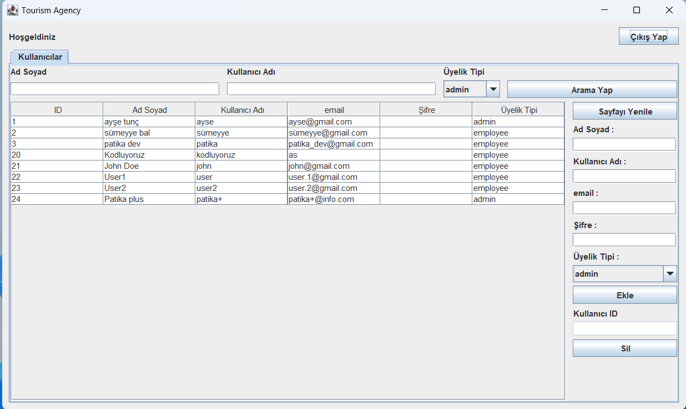

Filtreleme işlemi

Ad soyad , Kullanıcı Adı ve Üyelik Tipine göre Filtreleme Yapılabilir.
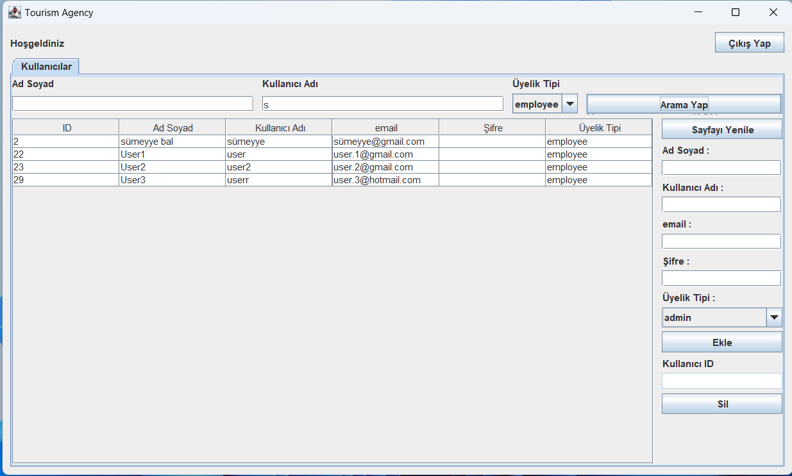

Ekleme işlemi

Boş Alan bırakılırsa "Lütfen tüm alanları doldurun" mesajı verilir.
Ekleme işlemi yapıldıktan sonra tüm alanlar dolu ise  "İşlem Başarılı" mesajı verilir
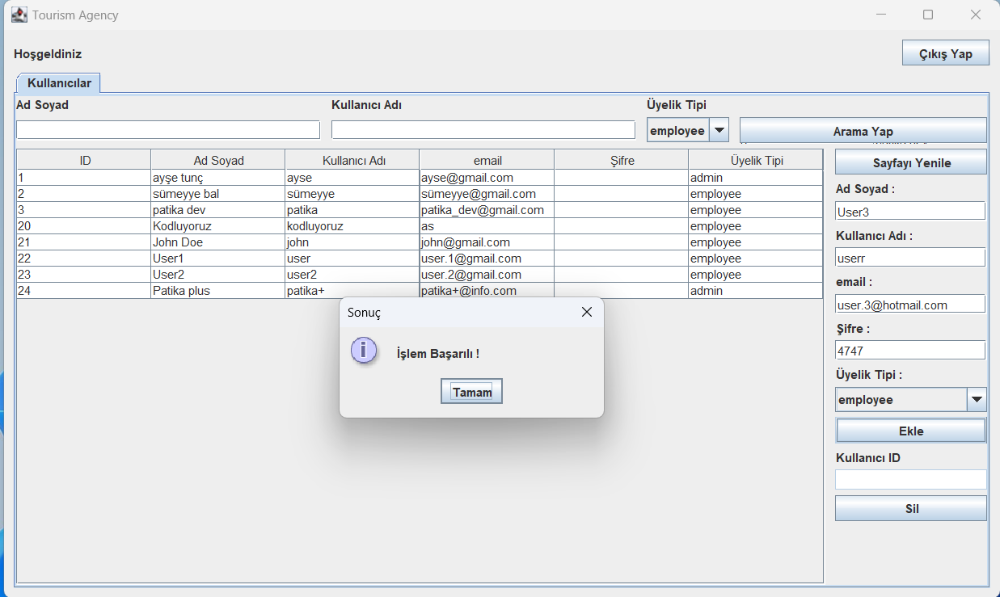

Silme işlemi

Silme işlemi yapıldıktan sonra "İşlem Başarılı" mesajı verilir
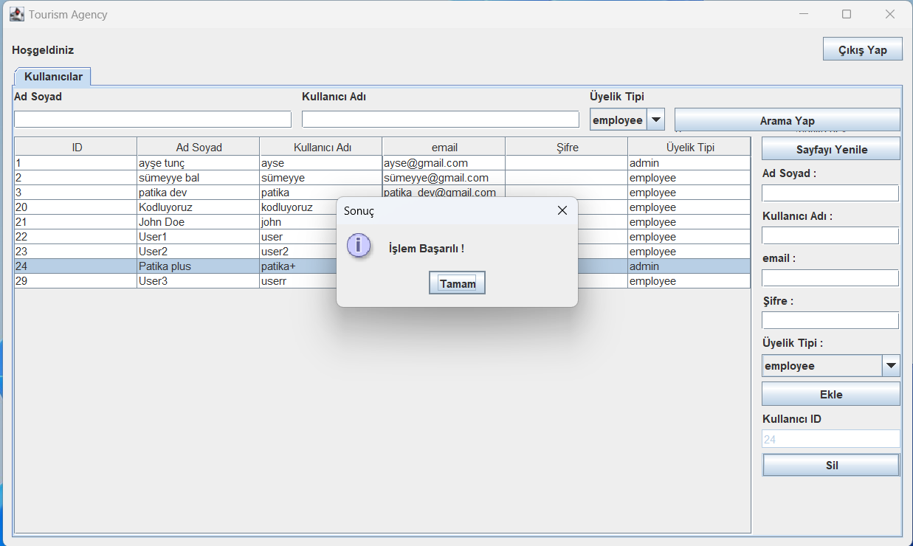

EMPLOYEE EKRANI

Employee ekranında Otel yönetimi , Oda yönetimi ve rezervasyon ekranları bulunur.
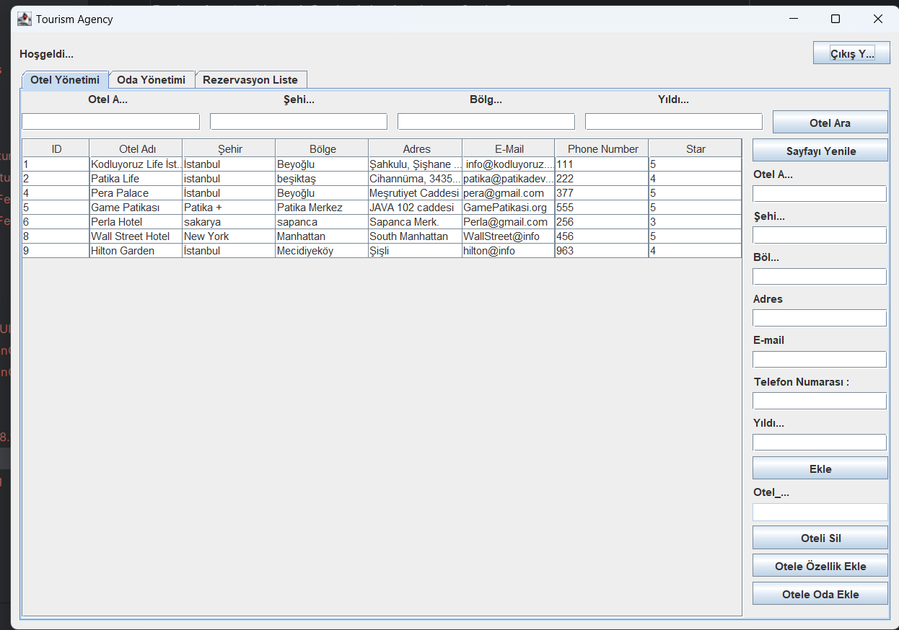

Otel Yönetimi ekranında   sisteme yeni otel ekleme, otele özellik ekleme , otele oda ekleme
otel arama ve otel silme gibi işlemler yapılır .

Otel ekleme

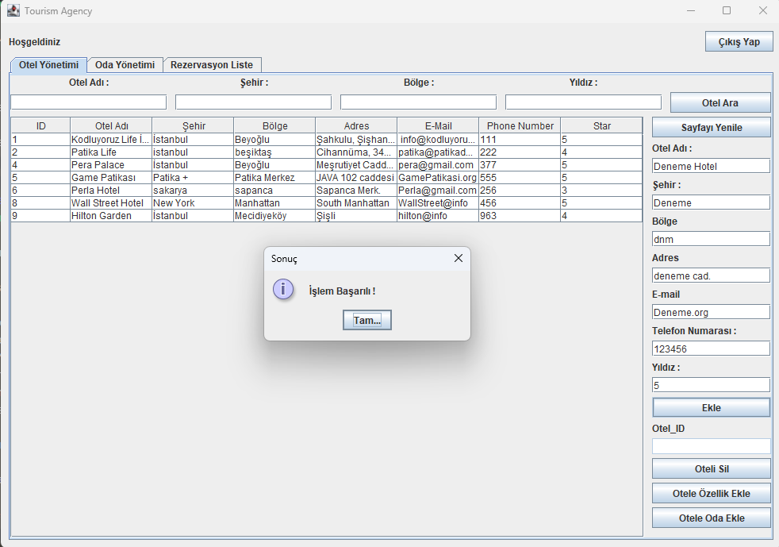

Otel ekleme bölümünde boş satır olursa ekrana Hata Mesajı verilir.
Boş satır olmazsa "İşlem Başarılı" mesajı verilir ve Otel ekleme işlemi tamamlanır.

OTELE ÖZELLİK EKLEME EKRANI

Seçim yapmadan otele özellik eklenemez. Ekrana Hata mesajı verilir.
Bu ekranda pansiyon özellikleri , Tesis özellikleri ve Sezon ekleme işlemi yapılır.
Boş Alan bırakılırsa "Lütfen tüm alanları doldurun" mesajı verilir.
Ekleme işlemi yapıldıktan sonra tüm alanlar dolu ise  "İşlem Başarılı" mesajı verilir

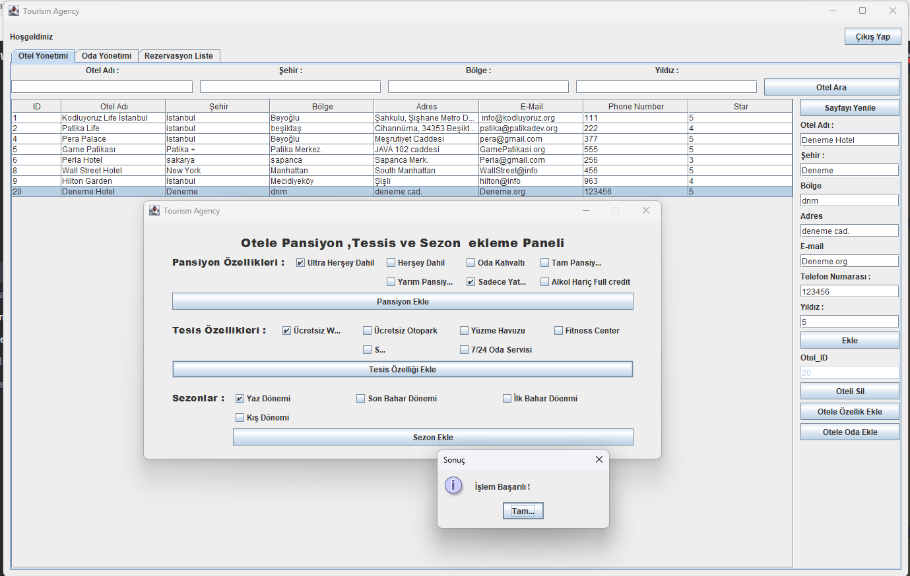

OTELE ODA EKLEME EKRANI

Bu ekranda seçilen otele oda tipini,dönemi,pansiyon tipini stok ,ve ücretler belirlenerek oda eklenir.
Boş Alan bırakılırsa "Lütfen tüm alanları doldurun" mesajı verilir.
Ekleme işlemi yapıldıktan sonra tüm alanlar dolu ise  "İşlem Başarılı" mesajı verilir

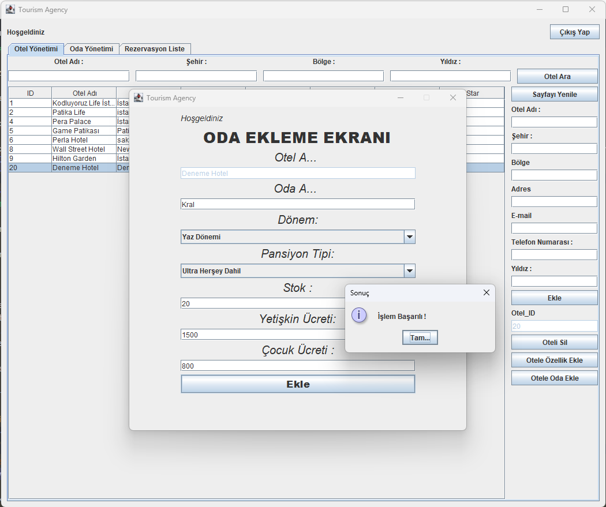

Otel filtreleme
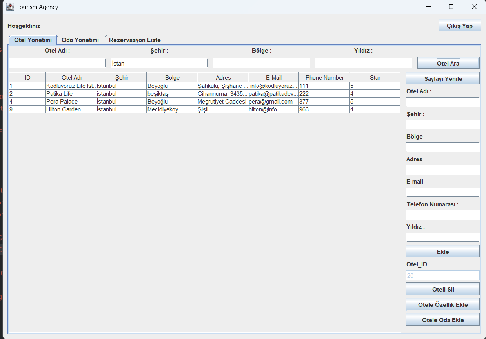

Otel Silme

Silme işlemi yapıldıktan sonra işlem başarılı mesajı verilir.
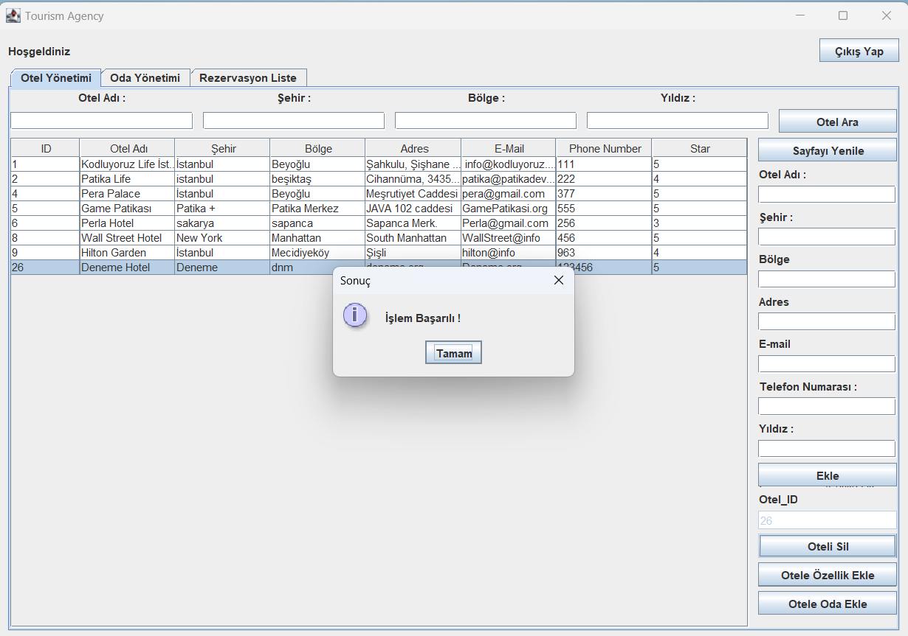

ODA YÖNETİMİ

Oda Yönetimi ekranında Oda arama , Odaya Özellik ekleme , Oda silme ve Seçilen Odaya Rezervasyon yapma işlemleri yapılır.

Oda silme

Oda Silme yapıldıktan sonra İşlem Başarılı mesajı verilir.
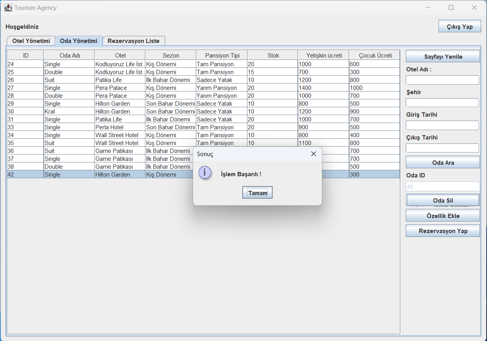

Odaya Özellik ekleme

Boş Alan bırakılırsa "Lütfen tüm alanları doldurun" mesajı verilir.
Ekleme işlemi yapıldıktan sonra tüm alanlar dolu ise  "İşlem Başarılı" mesajı verilir

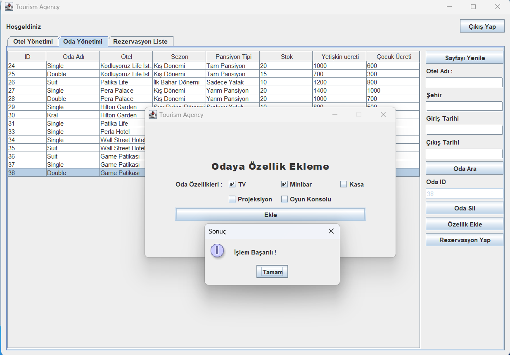

REZERVASYON EKRANI

Rezervasyon Ekranında sol bölümde seçilen odaya ait otel ve oda bilgileri yer alır. Sağ bölümde Müşteriye ait bilgiler yazılır.
Bu ekranda Rezerve edilen odanın Fiyat hesaplanması yapılır.Rezervasyon kaydedildikten sonra kullanıcıya İşlem Başarılı mesajı verilir.

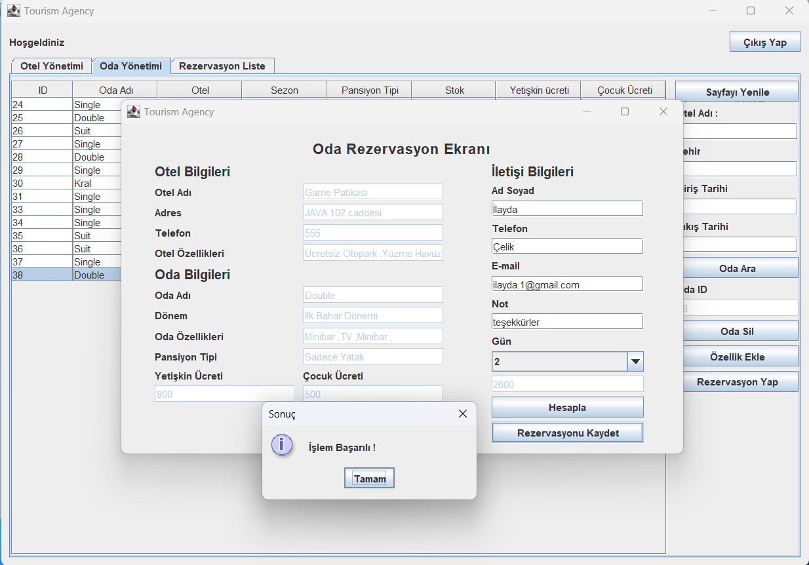

REZERVASYON LİSTESİ EKRANI

Burada rezervasyonalar listelenir ve Rezervasyon silme işlemi yapılır.
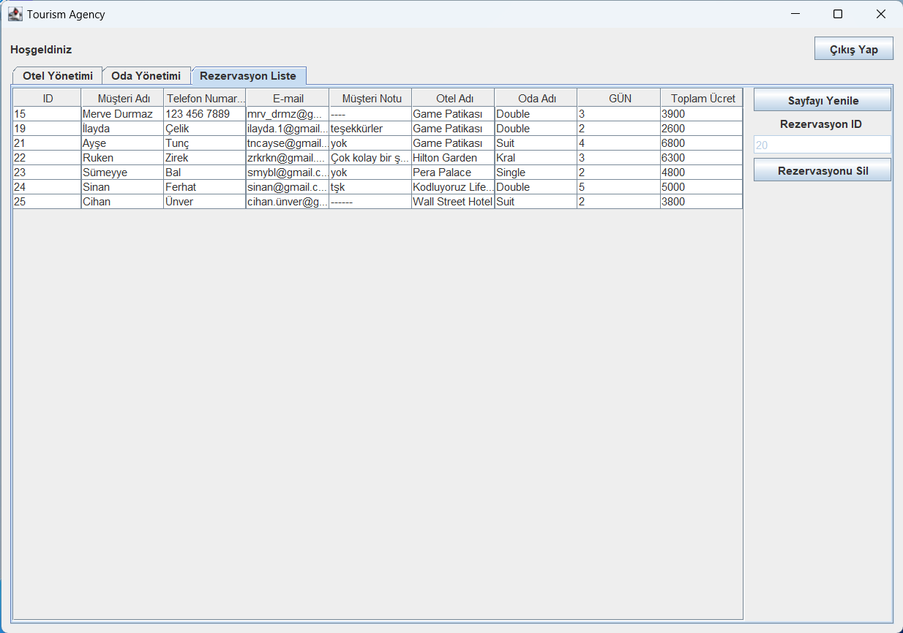

Silme işlemi yapıldıktan sonra İşlem Başarılı mesajı verilir.
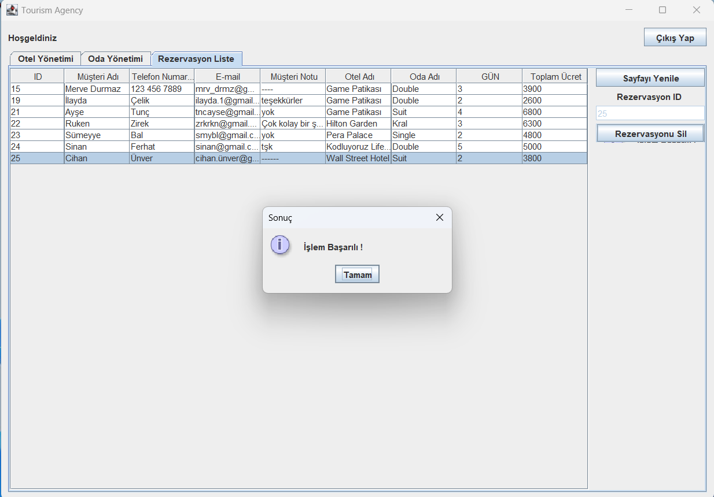

